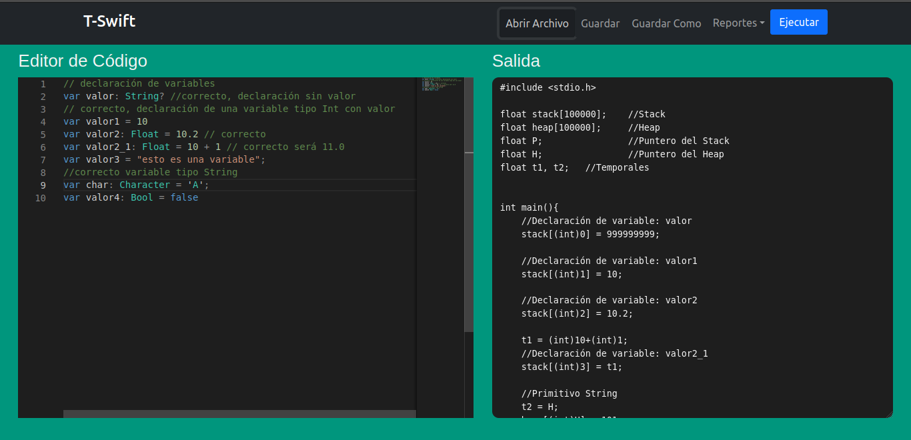
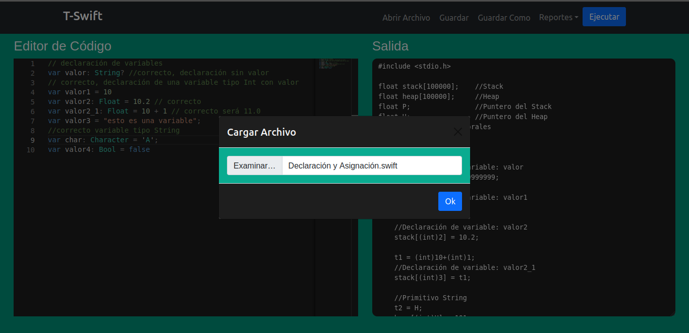
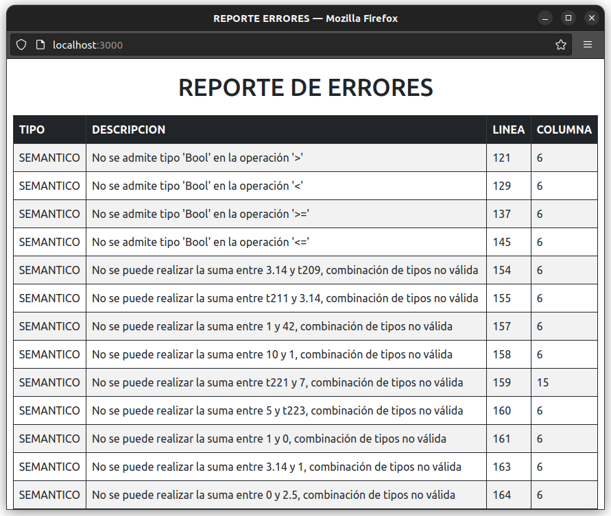
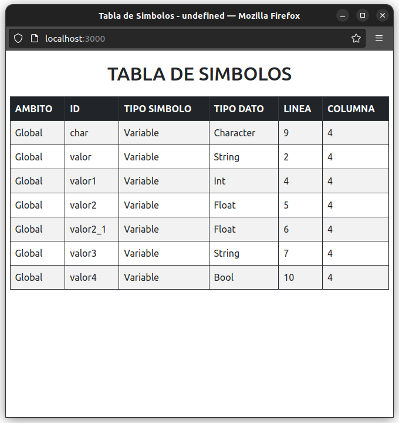

# MANUAL DE USUARIO

## DESCRIPCIÓN
T-Swift es un lenguaje basado en el popular lenguaje de programación Swift siendo este un
lenguaje multiparadigma que está ganando mucha popularidad debido a su sIntaxis
moderna y diversas características distIntivas de un lenguaje moderno, además Incorpora
características avanzadas como programación funcional, tipado estático, inferencia de tipos,
entre otros. Esto lo convierte en un lenguaje moderno y eficiente, siendo apto para su
estudio y comprensión para fines del laboratorio.    
T-Swift IDE es un entorno de desarrollo que provee las herramientas para la escritura de
programas en lenguaje T-Swift. Este IDE nos da la posibilidad de visualizar tanto la salida
en consola de la ejecución del archivo fuente como los diversos reportes de la aplicación
que se explican más adelante. La Interfaz gráfica podrá ser desarrollada con la arquitectura
y el framework a elección del estudiante, siempre y cuando se utilice el lenguaje y las
herramientas indicadas por los tutores para el procesamiento y reconocimiento del lenguaje
T-Swift.   

## CARACTERISTICAS BÁSICAS
- Abrir, guardar y guardar como
- Editor de código
- Botón para ejecutar archivo
- Reporte de errores
- Reporte de tabla de símbolos
- Reporte de CST
- Consola de salida
## USO DEL PROGRAMA

### Editor de Código
Es donde se va a ingresar el código a traducir a código de 3 direcciones. Se encuentra del lado izquierdo de la imagen  
   

### Salida
Muestra la salida en Código de 3 direcciones en lenguaje C después de haber ejecutado el código. Se encuentra del lado derecho de la imagen  
   

### Botón Abrir
Abre un archivo .swift   
   

### Botón Guardar
Guarda el contenido del editor actual en el archivo .swift actual en la computadora 
### Botón Guardar Como
Guarda el contenido del editor actual en un nuevo archivo .swift en la computadora 
### Botón Ejecutar
Ejecuta el código ingresado en el editor 

### Reporte de Errores
Genera una tabla en una ventana nueva con todos los errores ocurridos durante la ejecución  
   

### Reporte de CST
Genera el arbol de analisis sintactico

### Reporte de Tabla de Símbolos
Genera una tabla en una nueva ventana con todas las variables y funciones declaradas  
   

